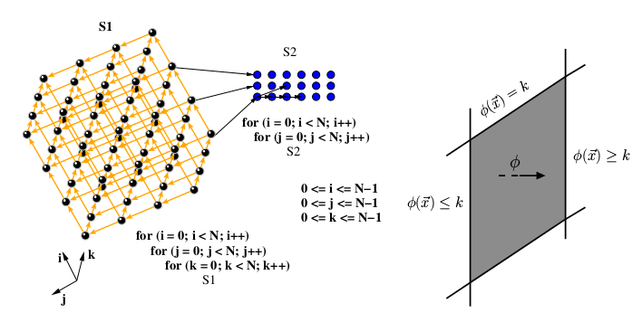

# Pluto

## Overview

</img><br/>

PLUTO is an automatic parallelization tool based on the [polyhedral
model](http://polyhedral.info).  The polyhedral model for compiler optimization
provides an abstraction to perform high-level transformations such as loop-nest
optimization and parallelization on affine loop nests. Pluto transforms C
programs from source to source for coarse-grained parallelism and data locality
simultaneously. The core transformation framework mainly works by finding affine
transformations for efficient tiling. The scheduling algorithm used by Pluto has
been published in [1]. OpenMP parallel code for multicores can be automatically
generated from sequential C program sections. Outer (communication-free), inner,
or pipelined parallelization is achieved purely with OpenMP parallel for
pragrams; the code is also optimized for locality and made amenable for
auto-vectorization. An experimental evaluation and comparison with previous
techniques can be found in [2]. Though the tool is fully automatic (C to OpenMP
C), a number of options are provided (both command-line and through meta files)
to tune aspects like tile sizes, unroll factors, and outer loop fusion
structure. [Cloog](https://github.com/periscop/cloog) is used for code
generation.

This is the chain of the entire source-to-source system that polycc will
run.

C code ⟶ Polyhedral extraction ⟶  Dependence analysis
           (clan or PET)                (ISL or candl)

⟶    Pluto transformer
      (core Pluto algorithm + post transformation)

 ⟶ CLooG                     ⟶       C (with OpenMP, ivdep pragmas)
 (cloog + clast processing
 to mark loops parallel, ivdep)

1. Automatic Transformations for Communication-Minimized Parallelization and
Locality Optimization in the Polyhedral Model, Uday Bondhugula, M. Baskaran, S.
Krishnamoorthy, J. Ramanujam, A. Rountev, and P. Sadayappan.  International
Conference on Compiler Construction (ETAPS CC), Apr 2008, Budapest, Hungary.

3. A Practical Automatic Polyhedral Parallelizer and Locality Optimizer
Uday Bondhugula, A. Hartono, J. Ramanujan, P. Sadayappan.  ACM SIGPLAN
Programming Languages Design and Implementation (PLDI), Jun 2008, Tucson,
Arizona.

This package includes both the tool pluto and libpluto. The `pluto` tool is a
source-to-source transformer meant to be run via the polycc script, `libpluto`
provides a thread-safe library interface.

[](https://github.com/bondhugula/pluto/actions/workflows/build_and_test.yml)

[](https://github.com/bondhugula/pluto/actions/workflows/clang_format.yml)

## License

Pluto and libpluto are available under the MIT LICENSE. Please see the file
`LICENSE` in the top-level directory for more details.

## Installing Pluto

### Prerequisites

A Linux distribution. Pluto has been tested on x86 and x86-64 machines running
Fedora, Ubuntu, and CentOS.

- In order to use the development version from Pluto's git repository, automatic
build system tools, including `autoconf`, `automake`, and `libtool` are needed.

- LLVM/Clang 14.x (14.x recommended, 11.x, 12.x tested to work as well), along
  with its development/header files, is needed for the pet submodule. These
  packages are available in standard distribution repositories or could be
  installed by building LLVM and Clang from source. See `pet/README` for
  additional details.  On most modern distributions, these can be installed from
  the repositories.

  Example:
  ```shell
  # On an Ubuntu.
  sudo apt install -y llvm-14-dev libclang-14-dev
  # On a Fedora.
  sudo dnf -y install llvm14-devel clang14-devel
  ```

- LLVM `FileCheck` is used for Pluto's test suite. (On a Fedora, this is part of
  the 'llvm' package.)

- GMP (GNU multi-precision arithmetic library) is needed by ISL (one of the
  included libraries).  If it's not already on your system, it can be installed
  easily with, for e.g., `sudo yum -y install gmp gmp-devel` on a Fedora (`sudo
  apt-get install libgmp3-dev` or something similar on an Ubuntu).

Pluto includes all polyhedral libraries on which it depends. See `pet/README` for
pet's pre-requisites.

### Building Pluto

**Stable release:**

Download the latest stable release from [GitHub
releases](https://github.com/bondhugula/pluto/releases).

```shell
$ tar zxvf pluto-<version>.tar.gz
$ cd pluto-<version>/
$ ./configure [--with-clang-prefix=<clang install location>]
$ make
$ make test
```

configure can be provided `--with-isl-prefix=<isl install location>` to build
with another isl version; otherwise, the bundled isl is used.

**Development version from Git:**

```shell
git clone git@github.com:bondhugula/pluto.git
cd pluto/
git submodule init
git submodule update
./autogen.sh
./configure [--enable-debug] [--with-clang-prefix=<clang headers/libs location>]
# Example: on an Ubuntu: --with-clang-prefix=/usr/lib/llvm-14, on a Fedora,
# typically, it's /usr/lib64/llvm14.
make
make check-pluto
```

* Use `--with-clang-prefix=<location>` to point to the specific clang to
build with.

* Use `--with-isl-prefix=<isl install location>` to compile and link with an
already installed isl. By default, the version of isl bundled with Pluto will be
used.

`polycc` is the wrapper script around src/pluto (core transformer) and all other
components. `polycc` runs all of these in sequence on an input C program (with
the section to parallelize/optimize marked) and is what a user should use on
input. The output generated is OpenMP parallel C code that can be readily compiled
and run on shared-memory parallel machines like general-purpose multicores.
`libpluto.{so,a}` is also built and can be found in `src/.libs/`. `make install`
will install it.

## Trying a new example

- Use `#pragma scop` and `#pragma endscop` around the section of code
  you want to parallelize/optimize.

- Then, just run `./polycc <C source file>`.

  The transformation is also printed out, and `test.par.c` will have the
  parallelized code. If you want to see intermediate files, like the
  `.cloog` file generated (`.opt.cloog`, `.tiled.cloog`, or `.par.cloog`,
  depending on command-line options provided), use `--debug` on the command
  line.

- Tile sizes can be specified in a file `tile.sizes`, otherwise, default sizes
will be set. See further below for details/instructions on how to specify/force
custom sizes.

To run a good number of experiments on a code, it is best to use the setup
created for example codes in the `examples/` directory.  If you do not have
`ICC` (Intel C compiler), uncomment line 9 and comment line
8 of `examples/common.mk` to use GCC.

- Just copy one of the sample directories in `examples/`, edit `Makefile` (`SRC
= `).

- do a `make` (this will build all executables; `orig` is the original code
compiled with the native compiler, `tiled` is the tiled code, `par` is the
OpenMP parallelized + locality-optimized code. One could do `make <target>`
where target can be orig, orig_par, opt, tiled, par, pipepar, etc. (see
`examples/common.mk` for a complete list).

- `make check-pluto` to test for correctness, `make perf` to compare
performance.


## Using Pluto

- Use '#pragma scop' and '#pragma endscop' around the section of code
  you want to parallelize/optimize.

- Then, run

    ./polycc <C source file> --parallel --tile

    The output file will be named <original prefix>.pluto.c unless '-o
    <filename>" is supplied. When --debug is used, the .cloog used to
    generate code is not deleted and is named similarly.

Please refer to the documentation of Clan or PET for information on the
kind of code around which one can put '#pragma scop' and '#pragma
endscop'.  Most of the time, although your program may not satisfy the
constraints, it may be possible to work around them.

## Command-line options

```shell
./polycc -h
```

    -o output
    Output to file 'output'. Without -o, name of the output file is
    determined as described earlier (under 'Using PLUTO')

    --help
    List all available options with a one-line summary

    --pet Use 'pet' to extract polyhedral representation from the source
    program instead of clan.

    --tile [--second-level-tile]
    Tile code; in addition, --second-level-tile will tile once more. By
    default, --second-level-tile is disabled. Tile sizes can be forced
    if needed from a file 'tile.sizes' (see below), otherwise, tile
      sizes are set automatically using a rough heuristic.  Tiling also
      allows the extraction of coarse-grained pipelined parallelism with the
      Pluto model.

    --intratileopt  [enabled by default]
    Optimize a tile's execution order for locality (spatial and temporal
    reuse); the right loop permutation for a tile will be chosen, in particular,
    the right innermost loop. Spatial locality is not otherwise captured
    by Pluto's cost function.

    --parallel
    Parallelize code with OpenMP (usually useful when used with --tile)

    --parallelize
    Same as --parallel

    --innnerpar
    Prefer inner parallelism over pipelined/wavefront parallelism obtained
    via skewing whenever both exist

    --multipar
    Will enable the extraction of multiple degrees of parallelism (from all
    parallel loops).  Disabled by default. By default, only one degree
    of outer parallelism or coarse-grained pipelined parallelism is
    extracted if it exists.

    --smartfuse [default]
    This is the default fusion heuristic. Will try to fuse between SCCs
    of the same dimensionality.

    --nofuse
    Separate all strongly-connected components (SCCs) in the dependence
    graphs to start with, i.e., no fusion across SCCs, and at any level
    inside.

    --maxfuse
    This is geared towards maximal fusion, but maximal fusion is not
    guaranteed. Fusion is done across SCCs.

    --[no]unrolljam
    Automatically identify and unroll-jam loops. Enabled by default.

    --ufactor=<n>
    Unroll or unroll-jam factor (default is 8). Note that if two loops
    are unroll-jammed by factor n, you will get an nxn body.

    --[no]prevector
    Perform post-transformations to make the code amenable to
    vectorization. Enabled by default.

    --rar
    Consider RAR dependences for optimization (increases running time by
    a little). Disabled by default

    --debug
    Verbose information to give some insights into the algorithm.  Intermediate
    files are not deleted (like the program-readable statement domains,
    dependences, pretty-printed dependences, the .cloog file, etc.). For the
    format of these files, see below.

    --verbose
    Higher level of output. ILP formulation constraints are
    pretty-printed out dependence-wise, along with solution hyperplanes
    at each level.

    --indent
    Indent generated code

    --islsolve
    Use ISL for solving ILPs

    --isldep
    See usage message (run polycc with no arguments)

    --lastwriter
    See usage message (run polycc with no arguments)

    --readscoplib
    Read input from a scoplib file

    --context=<value>
    An assertion from the user that all program parameters are greater than
    or equal to <value>

    --version
    Print version number and exit

	-q | --silent
	UNIX-style silence: no output as long as everything goes fine

    For more please see the output with '--help'.

    Besides these, 'tile.sizes' and '.fst' files allow the user to force
    certain things.

    Other options will only make sense to power users. See comments in
    src/pluto.h for details.


## Specifying custom tile sizes through the `tile.sizes` file

A 'tile.sizes' file in the current working directory can be used to manually
specify tile sizes. Specify one tile size on each line, and as many tile
sizes are there are hyperplanes in the outermost non-trivial permutable
band. When specifying tile sizes for multiple levels (with
--second-level-tile), first specify first-level tile sizes, then
second:first tile size ratios.  See examples/matmul/tile.sizes as an
example.  If
8x128x8 is the first level tile size, and 128x256x128 for the second
level, the tile.sizes file will be:

```
# First level tile size 8x128x8.
8
128
8
# Second level is 16*8 x 2*128 x 16*8.
16
2
16
```

The default tile size in the absence of a tile.sizes file is 32 (along
all dimensions), and the default second/first ratio is 8 (when using
--second-level-tile). The sizes specified correspond to transformed
loops in that order.  For eg., for heat-3d, you'll see this output when
you run Pluto

```shell
$ ../../polycc 3d7pt.c

[...]

[pluto] Affine transformations [<iter coeff's> <param> <const>]

T(S1): (t, t+i, t+j, t+k)
loop types (loop, loop, loop, loop)

[...]
```

Hence, the tile sizes specified correspond to t, t+i, t+j, and t+k.


### Setting good tile sizes

One would like to maximize locality while making sure there are enough
tiles to keep all cores busy. Rough thumb rules on selecting tile sizes
empirically are below.

(1) data set should fit in L2 roughly (or definitely within L3), (2) the
innermost dimension should have enough iterations, especially if it's
being vectorized so that (a) cleanup code, if any, doesn't hurt and (b)
prefetching provides benefits,
(3) for non-innermost dimensions from which temporal reuse is typically being
exploited, increasing tile size beyond 32 often provides diminishing
returns (additional reuse); so one may not want to experiment much
beyond 32. Each time tile.sizes is changed, the code has to be regenerated
(`rm -f *.tiled.c; make tiled; ./tiled`).

If one wishes to carefully tune tile sizes, it may be good to first run
Pluto without tiling (without --tile) and check the number of iterations
in each of the loops in the tilable band of the generated code, and then
determine tile sizes.

### Tile sizes for diamond tiling of stencils

Wherever diamond tiling is performed, the same tile size should be
chosen along the first two dimensions of the tile band; otherwise, the
tile wavefront will no longer be parallel to the concurrent start face,
and tile-wise concurrent start will be lost.


### Specifying a custom fusion structure through '.fst' or '.precut' file

One can force a particular fusion structure in two ways: either using
the .fst file or the .precut file. In either case, the file has to be in
your `present working directory'.  If both files exist in the directory
polycc is run from, '.fst' takes precedence. If --nofuse is specified,
distribution will be done in spite of a .fst/.precut.

#### Alternative 1 (.fst file)

A component is a subset of statements. Components are disjoint, and the
union of all components is the set of all statements. So the set of all
statements is partitioned into components. Here's the format of the .fst
file:

```
<number of components>
# description of 1st component
<number of statements in component>
<ids of statements in first component - an id is b/w 0 and num_stmts-1>
<whether to tile this component -- 0 for no, 1 or more for yes>
# description of 2nd component
...
```

See examples/gemver/.fst as an example; here is the meaning of a sample
.fst for examples/gemver/gemver.c:

```
3 # number of components
1 # number of statements in first component
0 # statement id's of statements in 1st component (id is from 0 to   num_stmts-1): so we have S0 here
0 # don't tile this component {S0}
2 # number of statements in second component
1 2  # stmts in this component are S1 and S2
256 # tile this component {S1,S2}
1 # number of statements in the third component
3 # stmt id 3, i.e., S3
0 # don't tile this {S3}
```

So, the above asks Pluto to distribute the statements at the outer
level as: {S0}, {S1,S2}, {S3}. It'll try to fuse as much as possible
within each component if you use --maxfuse along with the above .fst,
but will always respect the distribution specified.

#### Alternative 2

Using the '.precut' file

The '.precut' can be used to specify any partial transformation that Pluto
can then complete. This is a useful way to test or manually specify a
particular transformation, or to check if a particular transformation is a
valid one. The format of .precut is as below.

```
<number of statements>
<number of levels to tile>
# first statement
<number of rows, and number of columns for the partial transformation>
<rows of the partial transformation in Cloog-like scattering function
format. For eg.,  if the partial transformation is c1 = i+j+1 for a 2-d
statement with one program parameter, the row would be 0 1 1 0 1, the first
number is always a zero (for an equality), then 1 for i, 1 for j,
0 for the parameter, and 1 for the constant part>
<a number that's not currently used, specify anything>
<whether or not to tile each of the levels, 0 for `don't tile', any
other number for tiling; as many lines as the number of tiling levels
specified earlier>
# second statement
...
```

Parsing of any other text (like comments) in .fst or .precut is not
handled.


### More on post-processing

--prevector will cause bounds of the loop to be vectorized replaced by
scalars and insert the ivdep and 'vector always' pragmas to allow
vectorization with ICC. GCC does not support these, and its
vectorization capalibility is currently very limited.

### Looking at the transformation

Transformations are pretty-printed. The transformation is a
multi-dimensional affine function on a per-statement basis.


### Looking at the generated code

The best options for taking a good look at the generated code are:

<pluto_dir>/polycc source.c --noprevector --tile --parallel

or

<pluto_dir>/polycc source.c --noprevector

to just look at the transformation without the actual tiling and
parallelization performed; the transformation is just applied, and loop
fusion can be seen.

## Using Pluto as a library

See src/test_plutolib.c

To install libpluto on a system, run 'make install' from Pluto's top-level
directory.  libpluto.{so,a} can be found in src/.libs/


## Trying any included example code

Let's say we are trying the 2-d gauss seidel kernel. In `examples/seidel`, do
`make par`; this will generate `seidel.par.c` from `seidel.c` and also compile
it to generate `par`.  Likewise, `make tiled` for `tiled` and `make orig` for
`orig`.

```shell
cd examples/seidel
```

`seidel.c`: This is the original code (the kernel in this code is extracted).
`orig` is the corresponding executable when compiled with the native compiler
(`gcc` or `icc` for eg.) with optimization flags, `orig_par` with the native
compiler's auto-parallelization enabled.

`seidel.opt.c`: This is the transformed code without tiling (this is of not much
use, except for seeing the benefits of fusion in some cases). `opt` is the
corresponding executable.

`seidel.tiled.c`: This is Pluto-generated code optimized for locality with
tiling and other transformations, but not parallelized - this should be used
for sequential execution. `tiled` is the corresponding executable.

`seidel.par.c`: This is Pluto parallelized code optimized for locality and
parallelism  with tiling and other transformations. This code has OpenMP
pragmas. `par` is the corresponding executable.

- To change any of the flags used for an example, edit the top section of
`examples/common.mk` or the `Makefile` in the example directory

- To manually specify tile sizes, create `tile.sizes`; see `examples/matmul/`
for example or further below for more information on setting tile sizes.

The executables already have timers; you just have to run them, and that will
print execution time for the core part of the computation as well.

To run the Pluto parallelized version:

```shell
OMP_NUM_THREADS=4 ./par
```

To run native compiler optimized/auto-parallelized version:

```shell
OMP_NUM_THREADS=4 ./orig_par
```

To run the original sequential code:

```shell
./orig
```

To run the locality-optimized version generated by Pluto:

```shell
./tiled
```

`make clean` in the particular example's directory removes all executables as
well as generated codes.

To launch a complete verification that compares the output of tiled, par with orig
for all examples, in `examples/`, run `make check-pluto`.

```shell
[examples/ ]$ make check-pluto
```

## Bugs and issues

Please report bugs and issues at https://github.com/bondhugula/pluto/issues.

For questions and general discussion, please email
pluto-development@googlegroups.com after joining the group:
https://groups.google.com/g/pluto-development.
